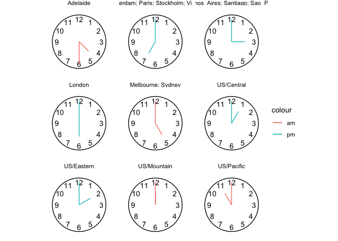

<!-- README.md is generated from README.Rmd. Please edit that file -->

<!-- badges: start -->

[](https://lifecycle.r-lib.org/articles/stages.html#experimental)
<!-- badges: end -->

# gglobalclocks

``` r
library(tidyverse)
── Attaching core tidyverse packages ─────────────────── tidyverse 2.0.0.9000 ──
✔ dplyr     1.1.0          ✔ readr     2.1.4     
✔ forcats   1.0.0          ✔ stringr   1.5.0     
✔ ggplot2   3.4.4.9000     ✔ tibble    3.2.1     
✔ lubridate 1.9.2          ✔ tidyr     1.3.0     
✔ purrr     1.0.1          
── Conflicts ────────────────────────────────────────── tidyverse_conflicts() ──
✖ dplyr::filter() masks stats::filter()
✖ dplyr::lag()    masks stats::lag()
ℹ Use the conflicted package (<http://conflicted.r-lib.org/>) to force all conflicts to become errors
library(lubridate)
```

### `time_to_local()`

``` r
time_to_local <- function(x, tz){
  lubridate::with_tz(x, tz = tz) %>%
    as.character()
}
```

### `date_time_tz_to_tzs()`

``` r
date_time_tz_to_tzs <- function(from_date_time = "2024-03-27 12:00:00", 
                                from_tz = "US/Mountain", 
                                to_tz = c("Europe/Paris", 
                                          "Europe/Amsterdam", 
                                          "Australia/Adelaide",
                                          "Australia/Melbourne", 
                                          "Europe/Stockholm", 
                                          "US/Eastern",
                                          "Europe/London", 
                                          "US/Pacific",
                                          "US/Mountain", 
                                          "US/Central", 
                                          "Australia/Sydney",
                                          "Europe/Vienna",
                                          "America/Sao_Paulo",
                                          "America/Santiago",
                                          "America/Buenos_Aires")){

   meeting <- ymd_hms(from_date_time, 
                      tz = from_tz)

OlsonNames() %>%
  data.frame(tz = .) %>%
  dplyr::filter(tz != "US/Pacific-New") %>%
  dplyr::filter(tz %in% to_tz) %>%
  dplyr::mutate(local_date_time_chr = purrr::map2(meeting, tz, time_to_local))  %>%
  tidyr::unnest(local_date_time_chr) %>%
  dplyr::mutate(local_time_date_utc = 
                  lubridate::ymd_hms(local_date_time_chr, tz = "UTC"))  %>% 
  dplyr::mutate(local_time = lubridate::ymd_hms(local_date_time_chr))  %>% 
  dplyr::mutate(local_time = hms::as_hms(local_time)) %>%
  dplyr::mutate(local_date = as.Date(local_date_time_chr)) %>%
  dplyr::mutate(local_wday = lubridate::wday(local_date, label = T)) %>%
  dplyr::arrange(local_date, local_time) %>%
  dplyr::select(-local_date_time_chr)

}
```

### `local_tzs_df_collapse()`

``` r
local_tzs_df_collapse <- function(local_tzs_df, collapse = "; "){
  
  local_tzs_df |>
    group_by(local_time, local_date, local_wday) |>
    summarise(locations = paste(tz, collapse = collapse)) |>
    ungroup() |>
    select(locations, everything()) |>
    mutate(locations = str_remove_all(locations, "Europe/|America/|Australia/"))
  
}
```

``` r
date_time_tz_to_tzs() |>
  head()
#> # A tibble: 6 × 5
#>   tz                   local_time_date_utc local_time local_date local_wday
#>   <chr>                <dttm>              <time>     <date>     <ord>     
#> 1 US/Pacific           2024-03-27 11:00:00 11:00      2024-03-27 Wed       
#> 2 US/Mountain          2024-03-27 12:00:00 12:00      2024-03-27 Wed       
#> 3 US/Central           2024-03-27 13:00:00 13:00      2024-03-27 Wed       
#> 4 US/Eastern           2024-03-27 14:00:00 14:00      2024-03-27 Wed       
#> 5 America/Buenos_Aires 2024-03-27 15:00:00 15:00      2024-03-27 Wed       
#> 6 America/Santiago     2024-03-27 15:00:00 15:00      2024-03-27 Wed

date_time_tz_to_tzs() |> 
  local_tzs_df_collapse() |> 
  head()
#> `summarise()` has grouped output by 'local_time', 'local_date'. You can
#> override using the `.groups` argument.
#> # A tibble: 6 × 4
#>   locations         local_time local_date local_wday
#>   <chr>             <time>     <date>     <ord>     
#> 1 Adelaide          04:30      2024-03-28 Thu       
#> 2 Melbourne; Sydney 05:00      2024-03-28 Thu       
#> 3 US/Pacific        11:00      2024-03-27 Wed       
#> 4 US/Mountain       12:00      2024-03-27 Wed       
#> 5 US/Central        13:00      2024-03-27 Wed       
#> 6 US/Eastern        14:00      2024-03-27 Wed
```

# More charming display…

``` r
date_time_tz_to_tzs() |> 
  local_tzs_df_collapse() |> 
  knitr::kable()
#> `summarise()` has grouped output by 'local_time', 'local_date'. You can
#> override using the `.groups` argument.
```

| locations                           | local\_time | local\_date | local\_wday |
| :---------------------------------- | :---------- | :---------- | :---------- |
| Adelaide                            | 04:30:00    | 2024-03-28  | Thu         |
| Melbourne; Sydney                   | 05:00:00    | 2024-03-28  | Thu         |
| US/Pacific                          | 11:00:00    | 2024-03-27  | Wed         |
| US/Mountain                         | 12:00:00    | 2024-03-27  | Wed         |
| US/Central                          | 13:00:00    | 2024-03-27  | Wed         |
| US/Eastern                          | 14:00:00    | 2024-03-27  | Wed         |
| Buenos\_Aires; Santiago; Sao\_Paulo | 15:00:00    | 2024-03-27  | Wed         |
| London                              | 18:00:00    | 2024-03-27  | Wed         |
| Amsterdam; Paris; Stockholm; Vienna | 19:00:00    | 2024-03-27  | Wed         |

# Inspiration - global clocks\!

``` r
date_time_tz_to_tzs() |> 
  local_tzs_df_collapse() |>
  mutate(minute_turn = local_time %>% 
           lubridate::minute() %% 60 / 60) %>% 
  mutate(hour_turn = local_time %>% 
           lubridate::hour() %% 12/12 + minute_turn/12) %>% 
  mutate(am_pm = ifelse(local_time %>% lubridate::hour() >= 12, "pm", "am")) %>% 
  ggplot() + 
  facet_wrap(~ str_wrap(locations, 15)) + 
  aes(x =  hour_turn, 
      xend =  hour_turn,
      y = 0,
      yend = .6,
      color = am_pm) + 
  labs(color = NULL) +
  geom_segment() + 
  geom_segment(aes(x =  minute_turn, 
                  xend =  minute_turn ,
               yend = 1) ) + 
  coord_polar() + 
  scale_x_continuous(limits = c(0,1)) + 
  geom_text(data = tibble(x = 1:12, y = 1), 
            aes(label = x, x = x/12, y = y, xend = NULL, 
                yend = NULL, color = NULL),
            show.legend = F) + 
  theme_void() + 
  annotate(geom = "segment", x = 0, xend = 1, y = 1.2, yend = 1.2)
#> `summarise()` has grouped output by 'local_time', 'local_date'. You can
#> override using the `.groups` argument.
```


## Practical more practical… (could be wrapped up in a function … or app)

``` r
date_time_tz_to_tzs() |> 
  local_tzs_df_collapse() |>  
  ggplot() + 
  aes(local_time, fct_inorder(str_wrap(locations,25))) + 
  labs(x = "Local meet time", y = NULL) + 
  geom_point() + 
  annotate(geom = "rect",
            xmin = hms::as_hms("09:00:00"),
            xmax = hms::as_hms("17:00:00"),
            ymin = -Inf,
            ymax = Inf,
           alpha = .2, 
           fill = "darkolivegreen3") + 
    geom_vline(xintercept = hms::as_hms("12:00:00"),
              linetype = "dashed", color = "grey25",
              alpha = .2) +
    annotate(geom = "rect",
            xmin = hms::as_hms("07:00:00"),
            xmax = hms::as_hms("09:00:00"),
            ymin = -Inf,
            ymax = Inf,
           alpha = .2, 
           fill = "goldenrod2") + 
      annotate(geom = "rect",
            xmin = hms::as_hms("17:00:00"),
            xmax = hms::as_hms("21:00:00"),
            ymin = -Inf,
            ymax = Inf,
           alpha = .2, 
           fill = "goldenrod2") + 
      annotate(geom = "rect",
            xmin = hms::as_hms("00:00:00"),
            xmax = hms::as_hms("07:00:00"),
            ymin = -Inf,
            ymax = Inf,
           alpha = .2, 
           fill = "black") + 
        annotate(geom = "rect",
            xmin = hms::as_hms("21:00:00"),
            xmax = hms::as_hms("23:00:00"),
            ymin = -Inf,
            ymax = Inf,
           alpha = .2, 
           fill = "black") + 
  geom_text(aes(label = local_time),
            hjust = -.1, show.legend = F) + 
  aes(color = paste0(local_wday, " ", month(local_date, label = T), ", ", day(local_date))) +
  labs(color = "Local meet date") +
  theme(legend.position = "top", 
        legend.justification = "left") + 
  theme(panel.grid.major.y = element_blank(),
        panel.grid.minor.y = element_line(color = ""))
#> `summarise()` has grouped output by 'local_time', 'local_date'. You can
#> override using the `.groups` argument.
```


# Part II. Packaging and documentation 🚧

## Phase 1. Minimal working package

### Bit A. Created package archetecture, running `devtools::create(".")` in interactive session. ✅

``` r
devtools::create(".")
```

### Bit B. Added roxygen skeleton? 🚧

Use a roxygen skeleton for auto documentation and making sure proposed
functions are *exported*. Generally, early on, I don’t do much
(anything) in terms of filling in the skeleton for documentation,
because things may change.

### Bit C. Managed dependencies ? 🚧

Package dependencies managed, i.e. `depend::function()` in proposed
functions and declared in the DESCRIPTION

``` r
usethis::use_package("dplyr")
usethis::use_package( "hms")
usethis::use_package( "lubridate")
usethis::use_package( "purrr")
usethis::use_package( "tidyr")
```

### Bit D. Moved functions R folder? ✅

Use new {readme2pkg} function to do this from readme…

``` r
readme2pkg::chunk_to_r("date_time_tz_to_tzs")
readme2pkg::chunk_to_r("local_tzs_df_collapse")
readme2pkg::chunk_to_r("time_to_local")
```

### Bit E. Run `devtools::check()` and addressed errors. 🚧

``` r
devtools::check(pkg = ".")
```

### Bit F. Build package 🚧 ✅

``` r
devtools::build()
```

### Bit G. Write traditional README that uses built package (also serves as a test of build. ✅

The goal of the {ggchalkboard} package is to make it easy to theme
ggplots like chalkboards

Install package with:

    remotes::install_github("EvaMaeRey/ggchalkboard")

Once functions are exported you can remove go to two colons, and when
things are are really finalized, then go without colons (and rearrange
your readme…)

``` r
library(gglobalclocks)  

gglobalclocks:::date_time_tz_to_tzs("2024-03-06 11:00:00", 
                                    from_tz = "US/Mountain",
                                    to_tz = c("US/Eastern",
                                              "US/Mountain",
                                              "US/Pacific",
                                              "Europe/Paris"))
```

### Bit H. Chosen a license? ✅

``` r
usethis::use_mit_license()
```

### Bit I. Add lifecycle badge (experimental) ✅

``` r
usethis::use_lifecycle_badge("experimental")
```

## Phase 2: Listen & iterate 🚧

Try to get feedback from experts on API, implementation, default
decisions. Is there already work that solves this problem?

## Phase 3: Let things settle

### Bit A. Settle on examples. Put them in the roxygen skeleton and readme. 🚧

### Bit B. Written formal tests of functions and save to test that folders 🚧

That would look like this…

``` r
library(testthat)

test_that("calc times 2 works", {
  expect_equal(times_two(4), 8)
  expect_equal(times_two(5), 10)
  
})
```

``` r
readme2pkg::chunk_to_tests_testthat("test_calc_times_two_works")
```

### Bit C. Added a description and author information in the DESCRIPTION file 🚧

### Bit D. Addressed *all* notes, warnings and errors. 🚧

## Phase 4. Promote to wider audience…

### Bit A. Package website built? ✅

``` r
usethis::use_pkgdown()
pkgdown::build_site()
```

### Bit B. Package website deployed? 🚧 ✅

## Phase 5: Harden/commit

### Submit to CRAN/RUniverse? 🚧

# Appendix: Reports, Environment

## Edit Description file

``` r
readLines("DESCRIPTION")
#>  [1] "Package: gglobalclocks"                             
#>  [2] "Title: What the Package Does (One Line, Title Case)"
#>  [3] "Version: 0.0.0.9000"                                
#>  [4] "Authors@R: "                                        
#>  [5] "    person(given = \"First\","                      
#>  [6] "           family = \"Last\","                      
#>  [7] "           role = c(\"aut\", \"cre\"),"             
#>  [8] "           email = \"first.last@example.com\","     
#>  [9] "           comment = c(ORCID = \"YOUR-ORCID-ID\"))" 
#> [10] "Description: What the package does (one paragraph)."
#> [11] "License: MIT + file LICENSE"                        
#> [12] "Encoding: UTF-8"                                    
#> [13] "LazyData: true"                                     
#> [14] "Roxygen: list(markdown = TRUE)"                     
#> [15] "RoxygenNote: 7.1.1"                                 
#> [16] "Imports: "                                          
#> [17] "    dplyr,"                                         
#> [18] "    hms,"                                           
#> [19] "    lubridate,"                                     
#> [20] "    purrr,"                                         
#> [21] "    tidyr"
```

## Environment

Here I just want to print the packages and the versions

``` r
all <- sessionInfo() |> print() |> capture.output()
all[11:20]
#>  [1] ""                                                                         
#>  [2] "attached base packages:"                                                  
#>  [3] "[1] stats     graphics  grDevices utils     datasets  methods   base     "
#>  [4] ""                                                                         
#>  [5] "other attached packages:"                                                 
#>  [6] " [1] lubridate_1.9.2      forcats_1.0.0        stringr_1.5.0       "      
#>  [7] " [4] dplyr_1.1.0          purrr_1.0.1          readr_2.1.4         "      
#>  [8] " [7] tidyr_1.3.0          tibble_3.2.1         ggplot2_3.4.4.9000  "      
#>  [9] "[10] tidyverse_2.0.0.9000"                                                
#> [10] ""
```

## `devtools::check()` report

``` r
devtools::check(pkg = ".")
```

What would gglobalclocks syntax look like using above approach as
jumping off point?

    gglobalclocks() + # wraps up theme void and coord_polar 
     stamp_clockface() + # wraps up drawing numbers and circle
     aes(local_date_time = date_timevar) + 
     geom_clockhands() + 
     facet_wrap(~location)

# returning to the actual global clocks idea.

``` r
gglobalclocks <- function(data = NULL){
  
  ggplot(data) + 
  list(theme_void(),
       coord_polar(),
       scale_x_continuous(limits = c(0,1)),
       scale_y_continuous(limits = c(0,1.3)))
  
}

gglobalclocks()
```


``` r

stamp_clockface <- function(){
  
    list(geom_text(data = tibble(x = 1:12, y = 1), 
            aes(label = x, x = x/12, y = y, xend = NULL, 
                yend = NULL, color = NULL, local_time = NULL),
            show.legend = F),
          annotate(geom = "segment", x = 0, xend = 1, y = 1.2, yend = 1.2)
         
    )
  
}

gglobalclocks() + stamp_clockface()
```


``` r

compute_clock_hands <- function(data){
  
  data |> 
  dplyr::mutate(minute_turn = local_time %>% lubridate::minute() %% 60 / 60) |> 
  dplyr::mutate(hour_turn = local_time %>% lubridate::hour() %% 12/12 + minute_turn/12) |>  
  dplyr::mutate(am_pm = ifelse(local_time %>% lubridate::hour() > 12, "pm", "am")) 
  
}

compute_hour_hand <- function(data, scales){
  
  data |>
    compute_clock_hands() |>
    dplyr::mutate(x =  hour_turn, 
      xend =  hour_turn,
      y = 0,
      yend = .6)
  
}

compute_minute_hand <- function(data, scales){
  
  data |>
    compute_clock_hands() |>
    dplyr::mutate(x =  minute_turn, 
      xend =  minute_turn,
      # color = am_pm, 
      y = 0,
      yend = 1)
  
}

date_time_tz_to_tzs() |> compute_clock_hands()
#> # A tibble: 15 × 8
#>    tz           local_time_date_utc local_time local_date local_wday minute_turn
#>    <chr>        <dttm>              <time>     <date>     <ord>            <dbl>
#>  1 US/Pacific   2024-03-27 11:00:00 11:00      2024-03-27 Wed                0  
#>  2 US/Mountain  2024-03-27 12:00:00 12:00      2024-03-27 Wed                0  
#>  3 US/Central   2024-03-27 13:00:00 13:00      2024-03-27 Wed                0  
#>  4 US/Eastern   2024-03-27 14:00:00 14:00      2024-03-27 Wed                0  
#>  5 America/Bue… 2024-03-27 15:00:00 15:00      2024-03-27 Wed                0  
#>  6 America/San… 2024-03-27 15:00:00 15:00      2024-03-27 Wed                0  
#>  7 America/Sao… 2024-03-27 15:00:00 15:00      2024-03-27 Wed                0  
#>  8 Europe/Lond… 2024-03-27 18:00:00 18:00      2024-03-27 Wed                0  
#>  9 Europe/Amst… 2024-03-27 19:00:00 19:00      2024-03-27 Wed                0  
#> 10 Europe/Paris 2024-03-27 19:00:00 19:00      2024-03-27 Wed                0  
#> 11 Europe/Stoc… 2024-03-27 19:00:00 19:00      2024-03-27 Wed                0  
#> 12 Europe/Vien… 2024-03-27 19:00:00 19:00      2024-03-27 Wed                0  
#> 13 Australia/A… 2024-03-28 04:30:00 04:30      2024-03-28 Thu                0.5
#> 14 Australia/M… 2024-03-28 05:00:00 05:00      2024-03-28 Thu                0  
#> 15 Australia/S… 2024-03-28 05:00:00 05:00      2024-03-28 Thu                0  
#> # ℹ 2 more variables: hour_turn <dbl>, am_pm <chr>
date_time_tz_to_tzs() |> compute_minute_hand()
#> # A tibble: 15 × 12
#>    tz           local_time_date_utc local_time local_date local_wday minute_turn
#>    <chr>        <dttm>              <time>     <date>     <ord>            <dbl>
#>  1 US/Pacific   2024-03-27 11:00:00 11:00      2024-03-27 Wed                0  
#>  2 US/Mountain  2024-03-27 12:00:00 12:00      2024-03-27 Wed                0  
#>  3 US/Central   2024-03-27 13:00:00 13:00      2024-03-27 Wed                0  
#>  4 US/Eastern   2024-03-27 14:00:00 14:00      2024-03-27 Wed                0  
#>  5 America/Bue… 2024-03-27 15:00:00 15:00      2024-03-27 Wed                0  
#>  6 America/San… 2024-03-27 15:00:00 15:00      2024-03-27 Wed                0  
#>  7 America/Sao… 2024-03-27 15:00:00 15:00      2024-03-27 Wed                0  
#>  8 Europe/Lond… 2024-03-27 18:00:00 18:00      2024-03-27 Wed                0  
#>  9 Europe/Amst… 2024-03-27 19:00:00 19:00      2024-03-27 Wed                0  
#> 10 Europe/Paris 2024-03-27 19:00:00 19:00      2024-03-27 Wed                0  
#> 11 Europe/Stoc… 2024-03-27 19:00:00 19:00      2024-03-27 Wed                0  
#> 12 Europe/Vien… 2024-03-27 19:00:00 19:00      2024-03-27 Wed                0  
#> 13 Australia/A… 2024-03-28 04:30:00 04:30      2024-03-28 Thu                0.5
#> 14 Australia/M… 2024-03-28 05:00:00 05:00      2024-03-28 Thu                0  
#> 15 Australia/S… 2024-03-28 05:00:00 05:00      2024-03-28 Thu                0  
#> # ℹ 6 more variables: hour_turn <dbl>, am_pm <chr>, x <dbl>, xend <dbl>,
#> #   y <dbl>, yend <dbl>


statClockminhand <- ggproto(`_class` = "statClockminhand",
                          `_inherit` = ggplot2::Stat,
                          # required_aes = c("local_time"),
                          compute_group = compute_minute_hand,
                          default_aes = ggplot2::aes(color =
                                                            ggplot2::after_stat(am_pm))
                           )

geom_minute_hand <- function(
  mapping = NULL,
  data = NULL,
  position = "identity",
  na.rm = FALSE,
  show.legend = NA,
  inherit.aes = TRUE, ...) {
  ggplot2::layer(
    stat = statClockminhand,  # proto object from step 2
    geom = ggplot2::GeomSegment,  # inherit other behavior
    data = data,
    mapping = mapping,
    position = position,
    show.legend = show.legend,
    inherit.aes = inherit.aes,
    params = list(na.rm = na.rm, ...)
  )
}

statClockhourhand <- ggproto(`_class` = "statClockhourhand",
                          `_inherit` = ggplot2::Stat,
                          # required_aes = c("local_time"),
                          compute_group = compute_hour_hand,
                          default_aes = ggplot2::aes(color =
                                                            ggplot2::after_stat(am_pm))
                           )

geom_hour_hand <- function(
  mapping = NULL,
  data = NULL,
  position = "identity",
  na.rm = FALSE,
  show.legend = NA,
  inherit.aes = TRUE, ...) {
  ggplot2::layer(
    stat = statClockhourhand,  # proto object from step 2
    geom = ggplot2::GeomSegment,  # inherit other behavior
    data = data,
    mapping = mapping,
    position = position,
    show.legend = show.legend,
    inherit.aes = inherit.aes,
    params = list(na.rm = na.rm, ...)
  )
}

date_time_tz_to_tzs() |>
  local_tzs_df_collapse() |>
gglobalclocks() +
  aes(local_time = local_time) +
  stamp_clockface() +
  geom_minute_hand() +
  geom_hour_hand() +
  facet_wrap(~locations)
#> `summarise()` has grouped output by 'local_time', 'local_date'. You can
#> override using the `.groups` argument.
```



``` r

geom_clock_hands <- function(...){
  
  list(geom_hour_hand(...),
       geom_minute_hand(...))
  
}

date_time_tz_to_tzs() |> 
  local_tzs_df_collapse() |>
  gglobalclocks() + 
  aes(local_time = local_time) + 
  stamp_clockface() + 
  geom_clock_hands() + 
  facet_wrap(~locations)
#> `summarise()` has grouped output by 'local_time', 'local_date'. You can
#> override using the `.groups` argument.
```


