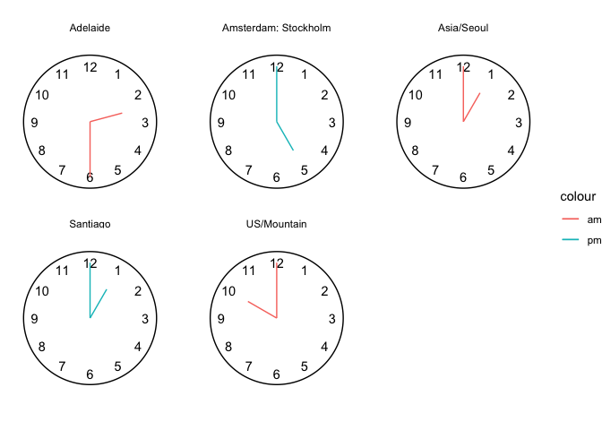

<!-- README.md is generated from README.Rmd. Please edit that file -->

# gglobalclocks

``` r
library(tidyverse)
#> ── Attaching core tidyverse packages ──────────────────────── tidyverse 2.0.0 ──
#> ✔ dplyr     1.1.0     ✔ readr     2.1.4
#> ✔ forcats   1.0.0     ✔ stringr   1.5.0
#> ✔ ggplot2   3.4.1     ✔ tibble    3.2.0
#> ✔ lubridate 1.9.2     ✔ tidyr     1.3.0
#> ✔ purrr     1.0.1     
#> ── Conflicts ────────────────────────────────────────── tidyverse_conflicts() ──
#> ✖ dplyr::filter() masks stats::filter()
#> ✖ dplyr::lag()    masks stats::lag()
#> ℹ Use the conflicted package (<http://conflicted.r-lib.org/>) to force all conflicts to become errors
library(lubridate)

ymd_hms("2023-08-19 09:00:00", 
        tz = "America/New_York") ->
  meeting

time_to_local <- function(x, tz){
  lubridate::with_tz(x, tz = tz) %>%
    as.character()
}


OlsonNames() %>%
  tibble(tz = .) %>%
  filter(tz != "US/Pacific-New") %>%
  filter(tz %>% str_detect("Amsterdam|Adelaide|Stockholm|US/Eastern|British|Europe/London|US/Pacific|Mountain|US/Central|Sydney|Europe/Vienna")) %>%
  mutate(meeting_ny = meeting) %>%
  mutate(local_time = purrr::map2(meeting_ny, tz, time_to_local))  %>%
  unnest(local_time) %>%
  group_by(local_time) %>%
  summarise(locations = paste(tz, collapse = "\n")) %>% 
  mutate(day = as_date(local_time) %>% wday(label = T)) ->
df

# df %>% 
#   ggplot() + 
#   facet_wrap(~locations) +
#   aes(angle = local_time %>% lubridate::hour() %% 12, 
#       radius = 1, x = 0, y = 0) +
#   geom_spoke(radius = .8) + 
#   geom_spoke(aes(angle = local_time %>% lubridate::minute() %% 60)) 
  

  
df %>% 
  mutate(minute_turn = local_time %>% lubridate::minute() %% 60 / 60) %>% 
  mutate(hour_turn = local_time %>% lubridate::hour() %% 12/12 + minute_turn/12) %>% 
  mutate(am_pm = ifelse(local_time %>% lubridate::hour() > 12, "pm", "am")) %>% 
  ggplot() + 
  facet_wrap(~locations) + 
  aes(x =  hour_turn, 
      xend =  hour_turn,
      y = 0,
      yend = .6,
      color = am_pm) + 
  labs(color = NULL) +
  geom_segment() + 
  geom_segment(aes(x =  minute_turn, 
                  xend =  minute_turn ,
               yend = 1) ) + 
  coord_polar() + 
  scale_x_continuous(limits = c(0,1)) + 
  geom_text(data = tibble(x = 1:12, y = 1), 
            aes(label = x, x = x/12, y = y, xend = NULL, 
                yend = NULL, color = NULL),
            show.legend = F) + 
  theme_void() + 
  annotate(geom = "segment", x = 0, xend = 1, y = 1.2, yend = 1.2)
```



What would gglobalclocks syntax look like using above approach as
jumping off point?

    gglobalclocks() + # wraps up theme void and coord_polar 
     stamp_clockface() + # wraps up drawing numbers and circle
     aes(local_date_time = date_timevar) + 
     geom_clockhands() + 
     facet_wrap(~location)

``` r
gglobalclocks <- function(data = NULL){
  
  ggplot(data) + 
  list(theme_void(),
       coord_polar(),
       scale_x_continuous(limits = c(0,1)),
       scale_y_continuous(limits = c(0,1.3)))
  
}

gglobalclocks()
```


``` r

stamp_clockface <- function(){
  
    list(geom_text(data = tibble(x = 1:12, y = 1), 
            aes(label = x, x = x/12, y = y, xend = NULL, 
                yend = NULL, color = NULL, local_time = NULL),
            show.legend = F),
          annotate(geom = "segment", x = 0, xend = 1, y = 1.2, yend = 1.2)
         
    )
  
}

gglobalclocks() + stamp_clockface()
```


``` r

compute_clock_hands <- function(data){
  
  data |> 
  mutate(minute_turn = local_time %>% lubridate::minute() %% 60 / 60) |> 
  mutate(hour_turn = local_time %>% lubridate::hour() %% 12/12 + minute_turn/12) |>  
  mutate(am_pm = ifelse(local_time %>% lubridate::hour() > 12, "pm", "am")) 
  
}

compute_hour_hand <- function(data, scales){
  
  data |>
    compute_clock_hands() |>
    mutate(x =  hour_turn, 
      xend =  hour_turn,
      y = 0,
      yend = .6)
  
}

compute_minute_hand <- function(data, scales){
  
  data |>
    compute_clock_hands() |>
    mutate(x =  minute_turn, 
      xend =  minute_turn,
      # color = am_pm, 
      y = 0,
      yend = 1)
  
}

df |> compute_clock_hands()
#> # A tibble: 8 × 6
#>   local_time          locations                      day   minut…¹ hour_…² am_pm
#>   <chr>               <chr>                          <ord>   <dbl>   <dbl> <chr>
#> 1 2023-08-19 06:00:00 "US/Pacific"                   Sat       0     0.5   am   
#> 2 2023-08-19 07:00:00 "Canada/Mountain\nUS/Mountain" Sat       0     0.583 am   
#> 3 2023-08-19 08:00:00 "US/Central"                   Sat       0     0.667 am   
#> 4 2023-08-19 09:00:00 "US/Eastern"                   Sat       0     0.75  am   
#> 5 2023-08-19 14:00:00 "Europe/London"                Sat       0     0.167 pm   
#> 6 2023-08-19 15:00:00 "Europe/Amsterdam\nEurope/Sto… Sat       0     0.25  pm   
#> 7 2023-08-19 22:30:00 "Australia/Adelaide"           Sat       0.5   0.875 pm   
#> 8 2023-08-19 23:00:00 "Australia/Sydney"             Sat       0     0.917 pm   
#> # … with abbreviated variable names ¹​minute_turn, ²​hour_turn
df |> compute_minute_hand()
#> # A tibble: 8 × 10
#>   local_time         locat…¹ day   minut…² hour_…³ am_pm     x  xend     y  yend
#>   <chr>              <chr>   <ord>   <dbl>   <dbl> <chr> <dbl> <dbl> <dbl> <dbl>
#> 1 2023-08-19 06:00:… "US/Pa… Sat       0     0.5   am      0     0       0     1
#> 2 2023-08-19 07:00:… "Canad… Sat       0     0.583 am      0     0       0     1
#> 3 2023-08-19 08:00:… "US/Ce… Sat       0     0.667 am      0     0       0     1
#> 4 2023-08-19 09:00:… "US/Ea… Sat       0     0.75  am      0     0       0     1
#> 5 2023-08-19 14:00:… "Europ… Sat       0     0.167 pm      0     0       0     1
#> 6 2023-08-19 15:00:… "Europ… Sat       0     0.25  pm      0     0       0     1
#> 7 2023-08-19 22:30:… "Austr… Sat       0.5   0.875 pm      0.5   0.5     0     1
#> 8 2023-08-19 23:00:… "Austr… Sat       0     0.917 pm      0     0       0     1
#> # … with abbreviated variable names ¹​locations, ²​minute_turn, ³​hour_turn


statClockminhand <- ggproto(`_class` = "statClockminhand",
                          `_inherit` = ggplot2::Stat,
                          # required_aes = c("local_time"),
                          compute_group = compute_minute_hand,
                          default_aes = ggplot2::aes(color =
                                                            ggplot2::after_stat(am_pm))
                           )

geom_minute_hand <- function(
  mapping = NULL,
  data = NULL,
  position = "identity",
  na.rm = FALSE,
  show.legend = NA,
  inherit.aes = TRUE, ...) {
  ggplot2::layer(
    stat = statClockminhand,  # proto object from step 2
    geom = ggplot2::GeomSegment,  # inherit other behavior
    data = data,
    mapping = mapping,
    position = position,
    show.legend = show.legend,
    inherit.aes = inherit.aes,
    params = list(na.rm = na.rm, ...)
  )
}

statClockhourhand <- ggproto(`_class` = "statClockhourhand",
                          `_inherit` = ggplot2::Stat,
                          # required_aes = c("local_time"),
                          compute_group = compute_hour_hand,
                          default_aes = ggplot2::aes(color =
                                                            ggplot2::after_stat(am_pm))
                           )

geom_hour_hand <- function(
  mapping = NULL,
  data = NULL,
  position = "identity",
  na.rm = FALSE,
  show.legend = NA,
  inherit.aes = TRUE, ...) {
  ggplot2::layer(
    stat = statClockhourhand,  # proto object from step 2
    geom = ggplot2::GeomSegment,  # inherit other behavior
    data = data,
    mapping = mapping,
    position = position,
    show.legend = show.legend,
    inherit.aes = inherit.aes,
    params = list(na.rm = na.rm, ...)
  )
}

gglobalclocks(data = df) + 
  aes(local_time = local_time) + 
  stamp_clockface() + 
  geom_minute_hand() +
  geom_hour_hand() + 
  facet_wrap(~locations) 
```


``` r

geom_clock_hands <- function(...){
  
  list(geom_hour_hand(...),
       geom_minute_hand(...))
  
  
}

gglobalclocks(data = df) + 
  aes(local_time = local_time) + 
  stamp_clockface() + 
  geom_clock_hands() + 
  facet_wrap(~locations) 
```


