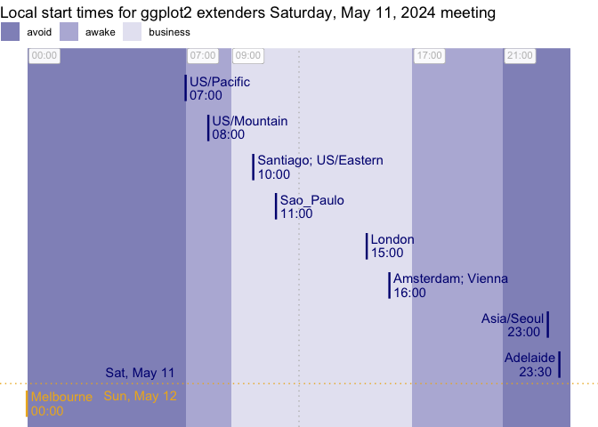

<!-- README.md is generated from README.Rmd. Please edit that file -->

<!-- badges: start -->

[](https://lifecycle.r-lib.org/articles/stages.html#experimental)
<!-- badges: end -->

# gglobalclocks

What if you could draw a beautiful ‘wall’ of clocks with local times
from around the world? Well, gglobalclocks lets you do that\!

I worked on the wall of clocks thinking it might help me schedule
virtual meetings with participant in lots of different time zones. Does
a beautiful wall of clocks help schedule global meetings? As it turns
out, in my experience, not really\!

But gglobalclocks also has utilities for building dataframes of
locations and local times which I have found helpful for multi-timezone
scheduling.

``` r
library(tidyverse)
gglobalclocks:::date_time_tz_to_tzs() |> 
  gglobalclocks:::local_tzs_df_collapse() |>
  gglobalclocks:::gglobalclocks() + 
    aes(local_time = local_time) + 
    gglobalclocks:::stamp_clockface() + 
    gglobalclocks:::geom_clock_hands() + 
    facet_wrap(~str_wrap(locations, 20))
```


``` r
  
tz_targets <- c("US/Mountain","US/Eastern","US/Eastern", "Europe/Paris", "Europe/Amsterdam", "America/Sao_Paulo", "America/Santiago", "Australia/Melbourne")

gglobalclocks:::date_time_tz_to_tzs(
  from_date_time = "2024-03-06 12:00:00",
  from_tz = "US/Mountain",
  to_tz = tz_targets)
#> # A tibble: 7 × 6
#>   tz        local_time_date_utc local_time local_date local_wday local_wday_date
#>   <chr>     <dttm>              <time>     <date>     <ord>      <chr>          
#> 1 US/Mount… 2024-03-06 12:00:00 12:00      2024-03-06 Wed        Wed, Mar 6     
#> 2 US/Easte… 2024-03-06 14:00:00 14:00      2024-03-06 Wed        Wed, Mar 6     
#> 3 America/… 2024-03-06 16:00:00 16:00      2024-03-06 Wed        Wed, Mar 6     
#> 4 America/… 2024-03-06 16:00:00 16:00      2024-03-06 Wed        Wed, Mar 6     
#> 5 Europe/A… 2024-03-06 20:00:00 20:00      2024-03-06 Wed        Wed, Mar 6     
#> 6 Europe/P… 2024-03-06 20:00:00 20:00      2024-03-06 Wed        Wed, Mar 6     
#> 7 Australi… 2024-03-07 06:00:00 06:00      2024-03-07 Thu        Thu, Mar 7

df <- gglobalclocks:::date_time_tz_to_tzs(
  from_date_time = "2024-03-06 12:00:00",
  from_tz = "US/Mountain",
  to_tz = tz_targets) |> 
  gglobalclocks:::local_tzs_df_collapse()

df
#> # A tibble: 5 × 4
#>   locations           local_time local_wday_date location           
#>   <chr>               <time>     <chr>           <fct>              
#> 1 US/Mountain         12:00      Wed, Mar 6      US/Mountain        
#> 2 US/Eastern          14:00      Wed, Mar 6      US/Eastern         
#> 3 Santiago; Sao_Paulo 16:00      Wed, Mar 6      Santiago; Sao_Paulo
#> 4 Amsterdam; Paris    20:00      Wed, Mar 6      Amsterdam; Paris   
#> 5 Melbourne           06:00      Thu, Mar 7      Melbourne

df |>  
  ggplot() + 
  gglobalclocks:::stamp_workday() +
  aes(local_time, fct_inorder(locations)) + 
  geom_point() +
  geom_text(aes(label = local_time)) + 
  aes(color = local_wday_date)
```



``` r
library(tidyverse)
library(lubridate)
```

-----

## Part II. Functions discussion and definitions

### `time_to_local()`

One helper function to do translation from one time zone to multiple
time zones is time\_to\_local. From working on global clocks, it seems
like you can’t keep date-times with different time zones in one vector
(or variable), so you need to do a conversion one by one and save a
character version of the complete time zone information.

``` r
time_to_local <- function(x, tz){
  lubridate::with_tz(x, tz = tz) %>%
    as.character()
}
```

### `date_time_tz_to_tzs()`

We can use the converter above to translate from a ‘from’ location and
time to a bunch of locations’ local times. We do this and then add a few
more helpful columns like local\_time, local\_date etc.

``` r
date_time_tz_to_tzs <- function(from_date_time = "2024-03-27 12:00:00", 
                                from_tz = "US/Mountain", 
                                to_tz = c("Europe/Paris", 
                                          "Europe/Amsterdam", 
                                          "Australia/Adelaide",
                                          "Australia/Melbourne", 
                                          "Europe/Stockholm", 
                                          "US/Eastern",
                                          "Europe/London", 
                                          "US/Pacific",
                                          "US/Mountain", 
                                          "US/Central", 
                                          "Australia/Sydney",
                                          "Europe/Vienna",
                                          "America/Sao_Paulo",
                                          "America/Santiago",
                                          "America/Buenos_Aires")){

   meeting <- ymd_hms(from_date_time, 
                      tz = from_tz)

OlsonNames() %>%
  data.frame(tz = .) %>%
  dplyr::filter(tz != "US/Pacific-New") %>%
  dplyr::filter(tz %in% to_tz) %>%
  dplyr::mutate(local_date_time_chr = purrr::map2(meeting, tz, time_to_local))  %>%
  tidyr::unnest(local_date_time_chr) %>%
  dplyr::mutate(local_time_date_utc = 
                  lubridate::ymd_hms(local_date_time_chr, tz = "UTC"))  %>% 
  dplyr::mutate(local_time = lubridate::ymd_hms(local_date_time_chr))  %>% 
  dplyr::mutate(local_time = hms::as_hms(local_time)) %>%
  dplyr::mutate(local_date = as.Date(local_date_time_chr)) %>%
  dplyr::mutate(local_wday = lubridate::wday(local_date, label = T)) %>%
  dplyr::arrange(local_date, local_time) %>%
  dplyr::select(-local_date_time_chr) %>%
  dplyr::mutate(local_wday_date = paste0(local_wday, ", ", month(local_date, label = T), " ", day(local_date)))

}
```

``` r
date_time_tz_to_tzs() |>
  head()
#> # A tibble: 6 × 6
#>   tz        local_time_date_utc local_time local_date local_wday local_wday_date
#>   <chr>     <dttm>              <time>     <date>     <ord>      <chr>          
#> 1 US/Pacif… 2024-03-27 11:00:00 11:00      2024-03-27 Wed        Wed, Mar 27    
#> 2 US/Mount… 2024-03-27 12:00:00 12:00      2024-03-27 Wed        Wed, Mar 27    
#> 3 US/Centr… 2024-03-27 13:00:00 13:00      2024-03-27 Wed        Wed, Mar 27    
#> 4 US/Easte… 2024-03-27 14:00:00 14:00      2024-03-27 Wed        Wed, Mar 27    
#> 5 America/… 2024-03-27 15:00:00 15:00      2024-03-27 Wed        Wed, Mar 27    
#> 6 America/… 2024-03-27 15:00:00 15:00      2024-03-27 Wed        Wed, Mar 27
```

### `local_tzs_df_collapse()`

If it turns out that you have multiple tz with the same local meeting
time, you can collapse these locations by local time.

``` r
local_tzs_df_collapse <- function(local_tzs_df, collapse = "; "){
  
  local_tzs_df |>
    group_by(local_date, local_time, local_wday_date) |>
    summarise(locations = paste(tz, collapse = collapse)) |>
    ungroup() |>
    select(locations, everything()) |>
    mutate(locations = str_remove_all(locations, "Europe/|America/|Australia/")) |>
    arrange(local_date, local_time) |>
    mutate(location = fct_inorder(locations)) |>
    select(-local_date)
  
}
```

This is the type of information you might send to an attendees list so
they can know, at a glance, their likelihood of making attending work.

``` r
date_time_tz_to_tzs() |> 
  local_tzs_df_collapse() |> 
  head()
#> `summarise()` has grouped output by 'local_date', 'local_time'. You can
#> override using the `.groups` argument.
#> # A tibble: 6 × 4
#>   locations                         local_time local_wday_date location         
#>   <chr>                             <time>     <chr>           <fct>            
#> 1 US/Pacific                        11:00      Wed, Mar 27     US/Pacific       
#> 2 US/Mountain                       12:00      Wed, Mar 27     US/Mountain      
#> 3 US/Central                        13:00      Wed, Mar 27     US/Central       
#> 4 US/Eastern                        14:00      Wed, Mar 27     US/Eastern       
#> 5 Buenos_Aires; Santiago; Sao_Paulo 15:00      Wed, Mar 27     Buenos_Aires; Sa…
#> 6 London                            18:00      Wed, Mar 27     London
```

# More charming display…

You can of course display in a nicer way, passing to html table maker
for example.

``` r
date_time_tz_to_tzs() |> 
  local_tzs_df_collapse() |> 
  knitr::kable()
#> `summarise()` has grouped output by 'local_date', 'local_time'. You can
#> override using the `.groups` argument.
```

| locations                           | local\_time | local\_wday\_date | location                            |
| :---------------------------------- | :---------- | :---------------- | :---------------------------------- |
| US/Pacific                          | 11:00:00    | Wed, Mar 27       | US/Pacific                          |
| US/Mountain                         | 12:00:00    | Wed, Mar 27       | US/Mountain                         |
| US/Central                          | 13:00:00    | Wed, Mar 27       | US/Central                          |
| US/Eastern                          | 14:00:00    | Wed, Mar 27       | US/Eastern                          |
| Buenos\_Aires; Santiago; Sao\_Paulo | 15:00:00    | Wed, Mar 27       | Buenos\_Aires; Santiago; Sao\_Paulo |
| London                              | 18:00:00    | Wed, Mar 27       | London                              |
| Amsterdam; Paris; Stockholm; Vienna | 19:00:00    | Wed, Mar 27       | Amsterdam; Paris; Stockholm; Vienna |
| Adelaide                            | 04:30:00    | Thu, Mar 28       | Adelaide                            |
| Melbourne; Sydney                   | 05:00:00    | Thu, Mar 28       | Melbourne; Sydney                   |

### Let’s build a wall of global clocks with base ggplot2

``` r
date_time_tz_to_tzs() |> 
  local_tzs_df_collapse() |>
  mutate(minute_turn = local_time %>% 
           lubridate::minute() %% 60 / 60) %>% 
  mutate(hour_turn = local_time %>% 
           lubridate::hour() %% 12/12 + minute_turn/12) %>% 
  mutate(am_pm = ifelse(local_time %>% lubridate::hour() >= 12, "pm", "am")) %>% 
  ggplot() + 
  facet_wrap(~ str_wrap(locations, 15)) + 
  aes(x =  hour_turn, 
      xend =  hour_turn,
      y = 0,
      yend = .6,
      color = am_pm) + 
  labs(color = NULL) +
  geom_segment() + 
  geom_segment(aes(x =  minute_turn, 
                  xend =  minute_turn ,
               yend = 1) ) + 
  coord_polar() + 
  scale_x_continuous(limits = c(0,1)) + 
  geom_text(data = tibble(x = 1:12, y = 1), 
            aes(label = x, x = x/12, y = y, xend = NULL, 
                yend = NULL, color = NULL),
            show.legend = F) + 
  theme_void() + 
  annotate(geom = "segment", x = 0, xend = 1, y = 1.2, yend = 1.2)
#> `summarise()` has grouped output by 'local_date', 'local_time'. You can
#> override using the `.groups` argument.
```


## Speed things up by putting some of this into functions

### `gglobalclocks()`

``` r
gglobalclocks <- function(data = NULL){
  
  ggplot2::ggplot(data) + 
  list(ggplot2::theme_void(),
       ggplot2::coord_polar(),
       ggplot2::scale_x_continuous(limits = c(0,1)),
       ggplot2::scale_y_continuous(limits = c(0,1.3)))
  
}
```

### `stamp_clockface()`

``` r
stamp_clockface <- function(){
  
    list(ggplot2::geom_text(data = data.frame(x = 1:12, y = 1), 
            ggplot2::aes(label = x, x = x/12, y = y, xend = NULL, 
                yend = NULL, color = NULL, local_time = NULL),
            show.legend = F),
          ggplot2::annotate(geom = "segment", x = 0, xend = 1, y = 1.2, yend = 1.2)
         
    )
  
}
```

``` r
gglobalclocks() + stamp_clockface()
```


### `statClockhourhand`

``` r
# there's probably a lot of fun to be had refactoring this!
# seems quite verbose
compute_clock_hands <- function(data){
  
  data |> 
  dplyr::mutate(minute_turn = local_time %>% lubridate::minute() %% 60 / 60) |> 
  dplyr::mutate(hour_turn = local_time %>% lubridate::hour() %% 12/12 + minute_turn/12) |>
  dplyr::mutate(am_pm = ifelse(local_time %>% lubridate::hour() > 12, "pm", "am")) 
  
}

compute_hour_hand <- function(data, scales){
  
  data |>
    compute_clock_hands() |>
    dplyr::mutate(x =  hour_turn, 
      xend =  hour_turn,
      y = 0,
      yend = .6)
  
}

compute_minute_hand <- function(data, scales){
  
  data |>
    compute_clock_hands() |>
    dplyr::mutate(x =  minute_turn, 
      xend =  minute_turn,
      # color = am_pm, 
      y = 0,
      yend = 1)
  
}


statClockminhand <- ggplot2::ggproto(`_class` = "statClockminhand",
                          `_inherit` = ggplot2::Stat,
                          # required_aes = c("local_time"),
                          compute_group = compute_minute_hand,
                          default_aes = ggplot2::aes(color =
                                                            ggplot2::after_stat(am_pm))
                           )

geom_minute_hand <- function(
  mapping = NULL,
  data = NULL,
  position = "identity",
  na.rm = FALSE,
  show.legend = NA,
  inherit.aes = TRUE, ...) {
  ggplot2::layer(
    stat = statClockminhand,  # proto object from step 2
    geom = ggplot2::GeomSegment,  # inherit other behavior
    data = data,
    mapping = mapping,
    position = position,
    show.legend = show.legend,
    inherit.aes = inherit.aes,
    params = list(na.rm = na.rm, ...)
  )
}

statClockhourhand <- ggplot2::ggproto(`_class` = "statClockhourhand",
                          `_inherit` = ggplot2::Stat,
                          # required_aes = c("local_time"),
                          compute_group = compute_hour_hand,
                          default_aes = ggplot2::aes(color =
                                                            ggplot2::after_stat(am_pm))
                           )
```

``` r
date_time_tz_to_tzs() |> compute_clock_hands()
#> # A tibble: 15 × 9
#>    tz       local_time_date_utc local_time local_date local_wday local_wday_date
#>    <chr>    <dttm>              <time>     <date>     <ord>      <chr>          
#>  1 US/Paci… 2024-03-27 11:00:00 11:00      2024-03-27 Wed        Wed, Mar 27    
#>  2 US/Moun… 2024-03-27 12:00:00 12:00      2024-03-27 Wed        Wed, Mar 27    
#>  3 US/Cent… 2024-03-27 13:00:00 13:00      2024-03-27 Wed        Wed, Mar 27    
#>  4 US/East… 2024-03-27 14:00:00 14:00      2024-03-27 Wed        Wed, Mar 27    
#>  5 America… 2024-03-27 15:00:00 15:00      2024-03-27 Wed        Wed, Mar 27    
#>  6 America… 2024-03-27 15:00:00 15:00      2024-03-27 Wed        Wed, Mar 27    
#>  7 America… 2024-03-27 15:00:00 15:00      2024-03-27 Wed        Wed, Mar 27    
#>  8 Europe/… 2024-03-27 18:00:00 18:00      2024-03-27 Wed        Wed, Mar 27    
#>  9 Europe/… 2024-03-27 19:00:00 19:00      2024-03-27 Wed        Wed, Mar 27    
#> 10 Europe/… 2024-03-27 19:00:00 19:00      2024-03-27 Wed        Wed, Mar 27    
#> 11 Europe/… 2024-03-27 19:00:00 19:00      2024-03-27 Wed        Wed, Mar 27    
#> 12 Europe/… 2024-03-27 19:00:00 19:00      2024-03-27 Wed        Wed, Mar 27    
#> 13 Austral… 2024-03-28 04:30:00 04:30      2024-03-28 Thu        Thu, Mar 28    
#> 14 Austral… 2024-03-28 05:00:00 05:00      2024-03-28 Thu        Thu, Mar 28    
#> 15 Austral… 2024-03-28 05:00:00 05:00      2024-03-28 Thu        Thu, Mar 28    
#> # ℹ 3 more variables: minute_turn <dbl>, hour_turn <dbl>, am_pm <chr>
date_time_tz_to_tzs() |> compute_minute_hand()
#> # A tibble: 15 × 13
#>    tz       local_time_date_utc local_time local_date local_wday local_wday_date
#>    <chr>    <dttm>              <time>     <date>     <ord>      <chr>          
#>  1 US/Paci… 2024-03-27 11:00:00 11:00      2024-03-27 Wed        Wed, Mar 27    
#>  2 US/Moun… 2024-03-27 12:00:00 12:00      2024-03-27 Wed        Wed, Mar 27    
#>  3 US/Cent… 2024-03-27 13:00:00 13:00      2024-03-27 Wed        Wed, Mar 27    
#>  4 US/East… 2024-03-27 14:00:00 14:00      2024-03-27 Wed        Wed, Mar 27    
#>  5 America… 2024-03-27 15:00:00 15:00      2024-03-27 Wed        Wed, Mar 27    
#>  6 America… 2024-03-27 15:00:00 15:00      2024-03-27 Wed        Wed, Mar 27    
#>  7 America… 2024-03-27 15:00:00 15:00      2024-03-27 Wed        Wed, Mar 27    
#>  8 Europe/… 2024-03-27 18:00:00 18:00      2024-03-27 Wed        Wed, Mar 27    
#>  9 Europe/… 2024-03-27 19:00:00 19:00      2024-03-27 Wed        Wed, Mar 27    
#> 10 Europe/… 2024-03-27 19:00:00 19:00      2024-03-27 Wed        Wed, Mar 27    
#> 11 Europe/… 2024-03-27 19:00:00 19:00      2024-03-27 Wed        Wed, Mar 27    
#> 12 Europe/… 2024-03-27 19:00:00 19:00      2024-03-27 Wed        Wed, Mar 27    
#> 13 Austral… 2024-03-28 04:30:00 04:30      2024-03-28 Thu        Thu, Mar 28    
#> 14 Austral… 2024-03-28 05:00:00 05:00      2024-03-28 Thu        Thu, Mar 28    
#> 15 Austral… 2024-03-28 05:00:00 05:00      2024-03-28 Thu        Thu, Mar 28    
#> # ℹ 7 more variables: minute_turn <dbl>, hour_turn <dbl>, am_pm <chr>, x <dbl>,
#> #   xend <dbl>, y <dbl>, yend <dbl>
```

### `geom_clock_hands()`

``` r
geom_hour_hand <- function(
  mapping = NULL,
  data = NULL,
  position = "identity",
  na.rm = FALSE,
  show.legend = NA,
  inherit.aes = TRUE, ...) {
  ggplot2::layer(
    stat = statClockhourhand,  # proto object from step 2
    geom = ggplot2::GeomSegment,  # inherit other behavior
    data = data,
    mapping = mapping,
    position = position,
    show.legend = show.legend,
    inherit.aes = inherit.aes,
    params = list(na.rm = na.rm, ...)
  )
}


geom_clock_hands <- function(...){
  
  list(geom_hour_hand(...),
       geom_minute_hand(...))
  
}
```

### Try it out

``` r
date_time_tz_to_tzs() |>
  local_tzs_df_collapse() |>
gglobalclocks() +
  aes(local_time = local_time) +
  stamp_clockface() +
  geom_minute_hand() +
  geom_hour_hand() +
  facet_wrap(~locations)
#> `summarise()` has grouped output by 'local_date', 'local_time'. You can
#> override using the `.groups` argument.
```


``` r

date_time_tz_to_tzs() |> 
  local_tzs_df_collapse() |>
  gglobalclocks() + 
  aes(local_time = local_time) + 
  stamp_clockface() + 
  geom_clock_hands() + 
  facet_wrap(~locations)
#> `summarise()` has grouped output by 'local_date', 'local_time'. You can
#> override using the `.groups` argument.
```


``` r
readme2pkg::chunk_to_r("gglobalclocks")
readme2pkg::chunk_to_r("stamp_clockface")

readme2pkg::chunk_to_r("statClockhourhand")
readme2pkg::chunk_to_r("geom_clock_hands")
```

## If a wall of clocks is unhelpful in scheduling, can we viz in a different way? Towards LocationXLocaTime plot

### `stamp_workday()`

We’ll use an ‘stamp’ (annotation) layer that helps us get oriented to
the 12 hours in a work day.

``` r
create_day_schedule_df <- function(){
  
  data.frame(time_start = 
               hms::as_hms(c("00:00:00","07:00:00", "09:00:00", "17:00:00","21:00:00")), 
             time_end = 
               hms::as_hms(c("07:00:00","09:00:00", "17:00:00", "21:00:00","24:00:00")),
             stance = c("avoid","awake", "business","awake","avoid"))
}


stamp_workday <- function(show.legend = T){  
  
  ggplot2::geom_rect(data = create_day_schedule_df(),
            ggplot2::aes(xmin = time_start,
                xmax = time_end, 
                x = NULL,
                fill = stance,
                ymin = -Inf,
                ymax = Inf,
                y = NULL,
                color = NULL),
           alpha = .5, show.legend = show.legend) 
}
```

``` r
readme2pkg::chunk_to_r(chunk_name = "stamp_workday")
```

## LocationXLocalTime

``` r
date_time_tz_to_tzs() |> 
  local_tzs_df_collapse() |>  
  ggplot() + 
  aes(local_time, fct_rev(fct_inorder(str_wrap(locations,25)))) + 
  labs(x = "Local meet time", y = NULL) + 
  stamp_workday() +
  geom_point() + 
  geom_text(aes(label = local_time),
            hjust = -.1, show.legend = F) + 
  geom_vline(xintercept = hms::as_hms("12:00:00"),
              linetype = "dashed", color = "grey25",
              alpha = .2) +
  aes(color = local_wday_date) +
  labs(color = "Local meet date") +
  theme(legend.position = "top", 
        legend.justification = "left") + 
  theme(panel.grid.major.y = element_blank(),
        panel.grid.minor.y = element_line(color = ""))
#> `summarise()` has grouped output by 'local_date', 'local_time'. You can
#> override using the `.groups` argument.
```


# Part II. Packaging and documentation 🚧

## Phase 1. Minimal working package

### Bit A. Created package archetecture, running `devtools::create(".")` in interactive session. ✅

``` r
devtools::create(".")
```

### Bit B. Added roxygen skeleton? 🚧

Use a roxygen skeleton for auto documentation and making sure proposed
functions are *exported*. Generally, early on, I don’t do much
(anything) in terms of filling in the skeleton for documentation,
because things may change.

### Bit C. Managed dependencies ? 🚧

Package dependencies managed, i.e. `depend::function()` in proposed
functions and declared in the DESCRIPTION

``` r
usethis::use_package("dplyr")
usethis::use_package( "hms")
usethis::use_package( "lubridate")
usethis::use_package( "purrr")
usethis::use_package( "tidyr")
```

### Bit D. Moved functions R folder? ✅

Use new {readme2pkg} function to do this from readme…

``` r
readme2pkg::chunk_to_r("date_time_tz_to_tzs")
readme2pkg::chunk_to_r("local_tzs_df_collapse")
readme2pkg::chunk_to_r("time_to_local")
```

### Bit E. Run `devtools::check()` and addressed errors. 🚧

``` r
devtools::check(pkg = ".")
```

### Bit F. Build package 🚧 ✅

``` r
devtools::build()
```

### Bit G. Write traditional README that uses built package (also serves as a test of build. ✅

The goal of the {ggchalkboard} package is to make it easy to theme
ggplots like chalkboards

Install package with:

    remotes::install_github("EvaMaeRey/ggchalkboard")

Once functions are exported you can remove go to two colons, and when
things are are really finalized, then go without colons (and rearrange
your readme…)

``` r
library(gglobalclocks)  

gglobalclocks:::date_time_tz_to_tzs("2024-03-06 11:00:00", 
                                    from_tz = "US/Mountain",
                                    to_tz = c("US/Eastern",
                                              "US/Mountain",
                                              "US/Pacific",
                                              "Europe/Paris"))
```

### Bit H. Chosen a license? ✅

``` r
usethis::use_mit_license()
```

### Bit I. Add lifecycle badge (experimental) ✅

``` r
usethis::use_lifecycle_badge("experimental")
```

## Phase 2: Listen & iterate 🚧

Try to get feedback from experts on API, implementation, default
decisions. Is there already work that solves this problem?

## Phase 3: Let things settle

### Bit A. Settle on examples. Put them in the roxygen skeleton and readme. 🚧

### Bit B. Written formal tests of functions and save to test that folders 🚧

That would look like this…

``` r
library(testthat)

test_that("calc times 2 works", {
  expect_equal(times_two(4), 8)
  expect_equal(times_two(5), 10)
  
})
```

``` r
readme2pkg::chunk_to_tests_testthat("test_calc_times_two_works")
```

### Bit C. Added a description and author information in the DESCRIPTION file 🚧

### Bit D. Addressed *all* notes, warnings and errors. 🚧

## Phase 4. Promote to wider audience…

### Bit A. Package website built? ✅

``` r
usethis::use_pkgdown()
pkgdown::build_site()
```

### Bit B. Package website deployed? 🚧 ✅

## Phase 5: Harden/commit

### Submit to CRAN/RUniverse? 🚧

# Appendix: Reports, Environment

## Edit Description file

``` r
readLines("DESCRIPTION")
#>  [1] "Package: gglobalclocks"                                                           
#>  [2] "Title: Create a Wall of Clocks with the Local Time for Locations Around the World"
#>  [3] "Version: 0.0.0.9000"                                                              
#>  [4] "Authors@R: "                                                                      
#>  [5] "    person(given = \"Gina\","                                                     
#>  [6] "           family = \"Reynolds\","                                                
#>  [7] "           role = c(\"aut\", \"cre\"),"                                           
#>  [8] "           email = \"first.last@example.com\","                                   
#>  [9] "           comment = c(ORCID = \"YOUR-ORCID-ID\"))"                               
#> [10] "Description: What the package does (one paragraph)."                              
#> [11] "License: MIT + file LICENSE"                                                      
#> [12] "Encoding: UTF-8"                                                                  
#> [13] "LazyData: true"                                                                   
#> [14] "Roxygen: list(markdown = TRUE)"                                                   
#> [15] "RoxygenNote: 7.1.1"                                                               
#> [16] "Imports: "                                                                        
#> [17] "    dplyr,"                                                                       
#> [18] "    hms,"                                                                         
#> [19] "    lubridate,"                                                                   
#> [20] "    purrr,"                                                                       
#> [21] "    tidyr"
```

## Environment

Here I just want to print the packages and the versions

``` r
all <- sessionInfo() |> print() |> capture.output()
all[11:20]
#>  [1] ""                                                                         
#>  [2] "attached base packages:"                                                  
#>  [3] "[1] stats     graphics  grDevices utils     datasets  methods   base     "
#>  [4] ""                                                                         
#>  [5] "other attached packages:"                                                 
#>  [6] " [1] lubridate_1.9.2      forcats_1.0.0        stringr_1.5.0       "      
#>  [7] " [4] dplyr_1.1.0          purrr_1.0.1          readr_2.1.4         "      
#>  [8] " [7] tidyr_1.3.0          tibble_3.2.1         ggplot2_3.4.4.9000  "      
#>  [9] "[10] tidyverse_2.0.0.9000"                                                
#> [10] ""
```

## `devtools::check()` report

``` r
devtools::check(pkg = ".")
```

What would gglobalclocks syntax look like using above approach as
jumping off point?
